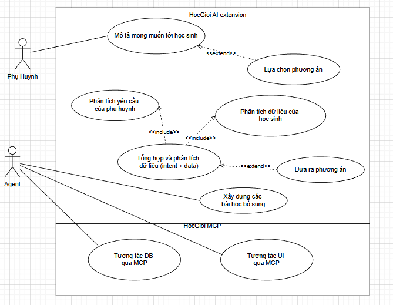

## **HỆ THỐNG GỢI Ý HỌC TẬP CÁ NHÂN HÓA**
> *PRD.v1.1*

## 1. Tổng quan
**Bối cảnh**
Hệ thông có sẵn : HocGioi – nền tảng học tập trực tuyến cho học sinh tiểu học (lớp 1–3) đã có sẵn:
* Nội dung học tập có phân cấp: chapters → topics → exercises
* Theo dõi tiến độ học tập (progress tracking)
* Hệ thống quản lý phụ huynh và học sinh

**Mục tiêu/ vấn đề giải quyết**  

| Vấn đề | Hiện trạng | Mục tiêu |
| --- | --- | --- |
| Phụ huynh không biết con yếu điểm gì | Chỉ xem progress thô | AI phân tích và giải thích bằng ngôn ngữ tự nhiên |
| Lộ trình học cứng nhắc | Tất cả học sinh học như nhau | Cá nhân hóa theo dữ liệu + mong muốn phụ huynh |
| Phụ huynh thụ động | Không có kênh góp ý | Phụ huynh góp ý, phê duyệt, điều chỉnh lộ trình |

**Phạm vi:** Phân tích dữ liệu học tập, xử lý input phụ huynh (text/voice), sinh gợi ý cá nhân hóa, tích hợp frontend hiện tại.

---

## 3. Mục tiêu
> Xây dựng extension cho phép phụ huynh chat với AI Agent để hỏi về tình hình học tập của con và bổ sung thông tin tình trạng, góp ý và nhận gợi ý học tập.  
### 3.1. Mục tiêu
* Phụ huynh hiểu rõ điểm mạnh/yếu của con qua nhận xét ngôn ngữ tự nhiên
* Phụ huynh có thể góp ý và duyệt lộ trình học tập
* Hệ thống tự động sinh bài tập bổ sung phù hợp

### 3.2. Mục tiêu kỹ thuật
* Xây dựng AI Agent orchestration bằng LangGraph
* Áp dụng kiến trúc MCP (Model Context Protocol) tool-based
* End-to-end latency < 10 giây
* Hỗ trợ đầy đủ tiếng Việt
---

## 4. Mô tả chức năng

### 4.1. Phân tích dữ liệu có sẵn của học sinh 

* Phân tích, tính toán độ chính xác, thời gian làm bài theo từng topic cụ thế của học sinh.
* Xác định các topic yếu

### 4.2. Xử lý input phụ huynh

* Nhận input dạng văn bản hoặc giọng nói
* Chuyển đổi voice thành text
* Trích xuất các vấn đề học tập

### 4.3. Gợi ý

* Đưa ra nhận xét tổng quan cho phụ huynh
* Xác định điểm yếu chính
* Gợi ý topic, xây dựng bài tập cụ thể
* Giải thích lý do đề xuất (optional)

### 4.4. AI Agent

* Agent chịu trách nhiệm điều phối toàn bộ logic
* Gọi các MCP tools để lấy dữ liệu và xử lý
* Tổng hợp thông tin và sinh kết quả

---

## 5. Kiến trúc hệ thống

### 5.1. Thành phần chính

* Frontend (Next.js)
* Supabase Database
* API Layer
* AI Agent (Claude)
* LangGraph (orchestration) : shared state 
* MCP Tools

### 5.2. MCP Tools
---

## 6. Luồng hoạt động cần xây dựng

1. Phụ huynh đưa mô tả (text hoặc voice)
2. AI Agent phân tích mô tả và dữ liệu học sinh
3. AI Agent tổng hợp thông tin.
4. AI Agent gọi tool để lấy nội dung học
5. AI Agent sinh kết quả gợi ý
6. Kết quả được trả về frontend

---

## 7. Use Case  

### Bảng Use Case tổng hợp

| ID    | Tên Use Case               | Actor     | Mô tả                                         | Input                  | Output                    |
| ----- | -------------------------- | --------- | --------------------------------------------- | ---------------------- | ------------------------- |
| UC-01 | Mô tả yêu cầu        | Phụ huynh | Phụ huynh nhập mô tả về điểm yếu, các yêu cầu về học tập của học sinh | Văn bản / giọng nói | Text mô tả                |
| UC-02 | Xử lý voice (phụ)                |   | Chuyển đổi giọng nói thành văn bản            | Audio                  | Text                      |
| UC-03 | Phân tích yêu cầu phụ huynh | AI Agent  | Trích xuất vấn đề học tập từ mô tả            | Text                   | Danh sách kỹ năng yếu     |
| UC-04 | Phân tích dữ liệu học sinh | AI Agent  | Phân tích dữ liệu học tập từ database         | child_id (s)              | Danh sách topic yếu       |
| UC-05 | Tổng hợp,phân tích dữ liệu           | AI Agent  | Kết hợp intent và dữ liệu học tập             | intent + analytics     | Context hoàn chỉnh        |
| UC-06 | Đưa ra các phương án học tập             | AI Agent  | Sinh nhận xét và đề xuất các pa học tập              |                 | Insight + recommendations |
| UC-07 | Lựa chọn phương án học tập           | PHụ huynh  | Lựa chọn/đề xuất mới phương án học tập                     |                | exercises                 |
| UC-08 | Xây dựng các bài học bổ sung           | AI Agent | Dựa vào lựa chọn của phụ huynh và dữ liệu học sinh               | Recommendation         | UI                        |
| UC-09 | Tương tác DB           | AI Agent | Tương tác với DB để lấy dữ liệu và xử lý               | Recommendation         |                         |
| UC-10 | Tương tác UI (optional)          | AI Agent | Tương tác với UI để xây dựng các bài học               | Recommendation         | UI                        |
---

### Mô tả chi tiết Use Case tiêu biểu

## 8. Yêu cầu phi chức năng

| Yêu cầu | Chỉ tiêu | Ghi chú |
| --- | --- | --- |
| Latency end-to-end | < 10 giây | Kể từ khi kết thúc gửi input đến khi hiện kết quả |
| Streaming response | optioanl  | Hiển thị từng phần khi agent xử lý |
| Ngôn ngữ | Tiếng Việt 100% | Output của agent, UI labels |
| Xử lý lỗi |  |  |
| Bảo mật |  |  |
| Context multi-turn | quan trọng  | hỗ trợ hội thoại nhiều lượt  |

---

## 9. Thiết kế dữ liệu mở rộng
---

## 10. Tiêu chí đánh giá
* Mức độ phù hợp của gợi ý mà hệ thống đưa ra
* Phụ huynh hiểu được kết quả, có thể phản hồi và chấp nhận/từ chối/ hoặc có thể góp ý vào gợi ý.
* Có khả năng chạy end-to-end ?
* Tích hợp thành công với hệ thống hiện tại

---

## 11. Hướng phát triển
---

## 12: Nhiệm vụ dự kiến hằng tuần
Tuần 1: Khởi tạo project, cấu hình môi trường, kết nối Supabase và xây dựng MCP server cơ bản để truy xuất dữ liệu.  
Tuần 2: Phát triển các MCP tools để lấy và xử lý dữ liệu học sinh, kiểm thử với dữ liệu thực tế.  
Tuần 2: Xây dựng agent bằng LangGraph, thiết lập luồng xử lý và tích hợp gọi MCP tools.  
Tuần 2.5: Xây dựng API bằng FastAPI và hoàn thiện hệ thống chạy end-to-end.  

Tuần 3+4: Phân tích yêu cầu của phụ huynh và trích xuất intent từ input.  
Tuần 5+6: Phân tích sâu dữ liệu học sinh, xây dựng các chỉ số và xu hướng học tập.  
Tuần 6+7: Xây dựng logic sinh khuyến nghị học tập và kế hoạch học.  
Tuần 8: Nghiên cứu và tích hợp sinh bài tập và lưu vào hệ thống.  
Tuần 9: Nghiên cứu và tích hợp chức năng chuyển giọng nói thành văn bản và ngược lại  
Tuần 10: Xây dựng cơ chế lưu ngữ cảnh và hỗ trợ hội thoại nhiều lượt.  

Tuần 11: Tích hợp frontend với Next.js và xây dựng giao diện chat.  
Tuần 12: Đánh giá chất lượng hệ thống và tối ưu kết quả của agent.  
Tuần 13: Triển khai hệ thống, kiểm thử tổng thể và hoàn thiện tài liệu, demo. 

## 13. Kết luận
Đề tài xây dựng một hệ thống AI Agent thực tế, tích hợp vào hệ thống sẵn có.  

*Hệ thống không chỉ mang tính nghiên cứu mà còn có khả năng triển khai thực tế trong giáo dục.*