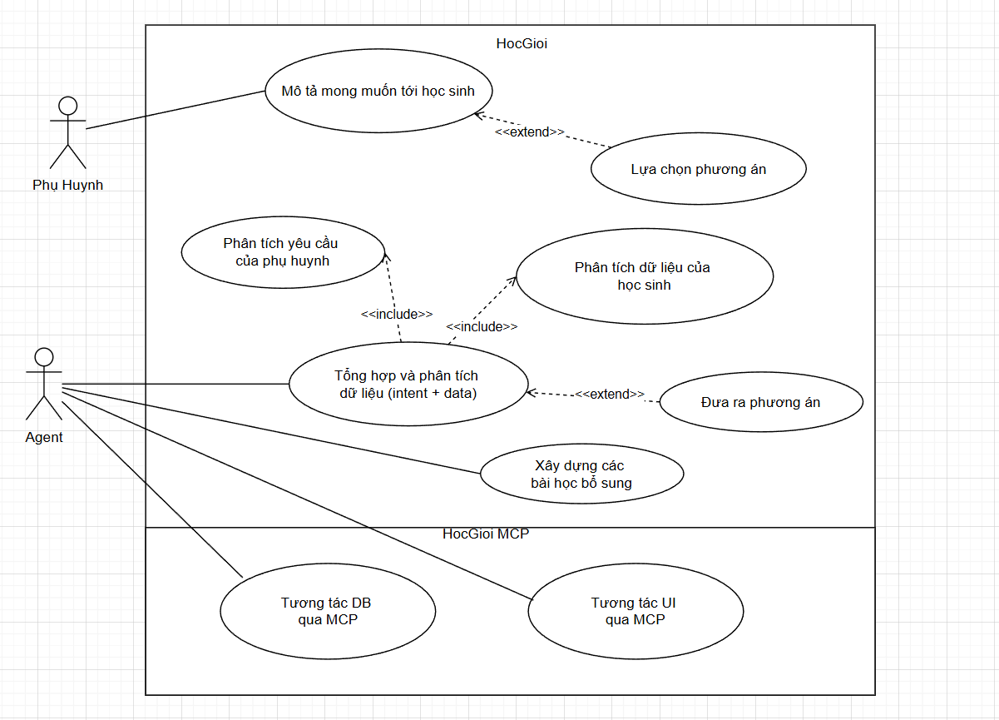

# PRODUCT REQUIREMENT DOCUMENT (PRD)

## 1. Thông tin chung
**Tên đề tài:**
Hệ thống gợi ý học tập cá nhân hóa sử dụng AI Agent và Model Context Protocol (MCP)

**Hệ thống nền tảng:**
HocGioi – nền tảng học tập trực tuyến cho học sinh tiểu học (lớp 1–3)

**Công nghệ sử dụng:**

* Frontend/Backend: Next.js
* Database: Supabase (PostgreSQL)
* AI: Claude Agent SDK / GG GenAI
* Orchestration: LangGraph
* MCP: Tool-based architecture

---

## 2. Tổng quan hệ thống

Hệ thống **HocGioi** đã cung cấp:

* Nội dung học (chapters, topics, exercises)
* Theo dõi tiến độ học tập (progress)
* Quản lý phụ huynh và học sinh

Chức năng đề tài phát triển thêm:
* Phân tích dữ liệu học tập
* Đưa ra nhận xét về năng lực học sinh
* Xây dựng phương pháp học phù hợp

Hệ thống đề xuất sẽ bổ sung module AI Agent nhằm:
* Phân tích dữ liệu học tập có sẵn của học sinh
* Hiểu mong muốn của phụ huynh
* Bổ sung vào lộ trình học tập các yêu cầu cá nhân hóa theo mong muốn của phụ huynh và dữ liệu của học sinh.
---

## 3. Mục tiêu
### 3.1. Mục tiêu chính

* Xây dựng hệ thống gợi ý học tập cá nhân hóa dựa trên dữ liệu có sẵn của học sinh
* Hỗ trợ phụ huynh hiểu rõ điểm mạnh và điểm yếu, góp ý vào nội dung học tập của học sinh
* Tự động xây dựng nội dung/ bài học bổ sung.

### 3.2. Mục tiêu kỹ thuật

* Áp dụng kiến trúc AI Agent kết hợp MCP
* Sử dụng LangGraph để điều phối luồng xử lý
* Tích hợp với hệ thống dữ liệu hiện có
Khác:
* Tốc độ tương tác cao với phụ huynh
---

## 4. Phạm vi hệ thống

### Phạm vi bao gồm

* Phân tích dữ liệu học tập (progress, exercises)
* Xử lý input từ phụ huynh (text, voice)
* Sinh nhận xét và gợi ý học tập
* Tích hợp với frontend hiện tại

---

## 5. Mô tả chức năng

### 5.1. Phân tích dữ liệu học sinh

* Tính toán độ chính xác, thời gian làm bài theo từng topic
* Xác định các topic yếu

### 5.2. Xử lý input phụ huynh

* Nhận input dạng văn bản hoặc giọng nói
* Chuyển đổi voice thành text
* Trích xuất các vấn đề học tập

### 5.3. Gợi ý học tập

* Đưa ra nhận xét tổng quan cho phụ huynh
* Xác định điểm yếu chính
* Gợi ý topic cần học
* Gợi ý bài tập cụ thể
* Giải thích lý do đề xuất

### 5.4. AI Agent

* Agent chịu trách nhiệm điều phối toàn bộ logic
* Gọi các MCP tools để lấy dữ liệu và xử lý
* Tổng hợp thông tin và sinh kết quả

---

## 6. Kiến trúc hệ thống

### 6.1. Thành phần chính

* Frontend (Next.js)
* Supabase Database
* API Layer
* AI Agent (Claude)
* LangGraph (orchestration)
* MCP Tools

### 6.2. MCP Tools

* student_analytics_tool: phân tích dữ liệu học sinh
* parent_intent_tool: xử lý input phụ huynh
* curriculum_tool: ánh xạ topic và bài tập
* recommendation_tool: tổng hợp kết quả

---

## 7. Luồng hoạt động cần xây dựng

1. Phụ huynh đưa mô tả (text hoặc voice)
2. AI Agent phân tích mô tả và dữ liệu học sinh
3. AI Agent tổng hợp thông tin.
4. AI Agent gọi tool để lấy nội dung học
5. AI Agent sinh kết quả gợi ý
6. Kết quả được trả về frontend

---

## 8. Use Case

### Bảng Use Case tổng hợp

| ID    | Tên Use Case               | Actor     | Mô tả                                         | Input                  | Output                    |
| ----- | -------------------------- | --------- | --------------------------------------------- | ---------------------- | ------------------------- |
| UC-01 | Mô tả yêu cầu        | Phụ huynh | Phụ huynh nhập mô tả về điểm yếu, các yêu cầu về học tập của học sinh | Văn bản / giọng nói | Text mô tả                |
| UC-02 | Xử lý voice (phụ)                | Hệ thống  | Chuyển đổi giọng nói thành văn bản            | Audio                  | Text                      |
| UC-03 | Phân tích yêu cầu phụ huynh | AI Agent  | Trích xuất vấn đề học tập từ mô tả            | Text                   | Danh sách kỹ năng yếu     |
| UC-04 | Phân tích dữ liệu học sinh | AI Agent  | Phân tích dữ liệu học tập từ database         | child_id (s)               | Danh sách topic yếu       |
| UC-05 | Tổng hợp,phân tích dữ liệu           | AI Agent  | Kết hợp intent và dữ liệu học tập             | intent + analytics     | Context hoàn chỉnh        |
| UC-06 | Đưa ra các phương án học tập             | AI Agent  | Sinh nhận xét và đề xuất các pa học tập              |                 | Insight + recommendations |
| UC-07 | Lựa chọn phương án học tập           | PHụ huynh  | Lựa chọn/đề xuất mới phương án học tập                     |                | exercises                 |
| UC-08 | Xây dựng các bài học bổ sung           | AI Agent | Dựa vào lựa chọn của phụ huynh và dữ liệu học sinh               | Recommendation         | UI                        |
| UC-09 | Tương tác DB           | AI Agent | Tương tác với DB để lấy dữ liệu và xử lý               | Recommendation         |                         |
| UC-10 | Tương tác UI (optional)          | AI Agent | Tương tác với UI để xây dựng các bài học               | Recommendation         | UI                        |
---

### Mô tả chi tiết Use Case tiêu biểu

## 9. Yêu cầu phi chức năng

* Thời gian phản hồi nhanh < 10 giây
* Xây dựng hệ thống và hỗ trợ tiếng Việt
* UI đẹp, đồng bộ với hệ thống

... 

---

## 10. Thiết kế dữ liệu mở rộng
---

## 11. Tiêu chí đánh giá
* Mức độ phù hợp của gợi ý mà hệ thống đưa ra
* Phụ huynh hiểu được kết quả, có thể phản hồi và chấp nhận/từ chối/ hoặc có thể góp ý vào gợi ý.
* Có khả năng chạy end-to-end ?
* Tích hợp thành công với hệ thống hiện tại

---

## 12. Hướng phát triển
---

## 13: Nhiệm vụ dự kiến hằng tuần
Tuần 1: Khởi tạo project, cấu hình môi trường, kết nối Supabase và xây dựng MCP server cơ bản để truy xuất dữ liệu.  
Tuần 2: Phát triển các MCP tools để lấy và xử lý dữ liệu học sinh, kiểm thử với dữ liệu thực tế.  
Tuần 2: Xây dựng agent bằng LangGraph, thiết lập luồng xử lý và tích hợp gọi MCP tools.  
Tuần 2.5: Xây dựng API bằng FastAPI và hoàn thiện hệ thống chạy end-to-end.  

Tuần 3+4: Phân tích yêu cầu của phụ huynh và trích xuất intent từ input.  
Tuần 5+6: Phân tích sâu dữ liệu học sinh, xây dựng các chỉ số và xu hướng học tập.  
Tuần 6+7: Xây dựng logic sinh khuyến nghị học tập và kế hoạch học.  
Tuần 8: Nghiên cứu và tích hợp sinh bài tập và lưu vào hệ thống.  
Tuần 9: Nghiên cứu và tích hợp chức năng chuyển giọng nói thành văn bản và ngược lại  
Tuần 10: Xây dựng cơ chế lưu ngữ cảnh và hỗ trợ hội thoại nhiều lượt.  

Tuần 11: Tích hợp frontend với Next.js và xây dựng giao diện chat.  
Tuần 12: Đánh giá chất lượng hệ thống và tối ưu kết quả của agent.  
Tuần 13: Triển khai hệ thống, kiểm thử tổng thể và hoàn thiện tài liệu, demo. 

## 14. Kết luận
Đề tài xây dựng một hệ thống AI Agent thực tế, kết hợp:

* Phân tích dữ liệu học tập
* Xử lý ngôn ngữ tự nhiên
* Kiến trúc MCP hiện đại

*Hệ thống không chỉ mang tính nghiên cứu mà còn có khả năng triển khai thực tế trong giáo dục.*